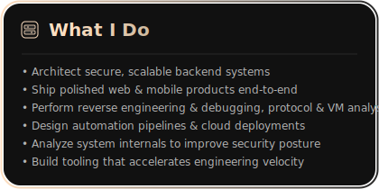
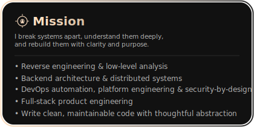

  

  Enthusiast Reverse Engineering · Full-Stack Developer · Security Engineering

<table align="center" style="border-collapse:collapse; border:none;">
  <tr>
    <td align="center" style="border:none; padding: 0 8px;">
      
    </td>
    <td align="center" style="border:none; padding: 0 8px;">
      
    </td>
  </tr>
</table>

## 🛠 Tech Stack

### **Languages**

`C` · `C++` · `C#` · `Rust` · `Go` · `Python` · `TypeScript` · `JavaScript` · `Dart` · `Java` · `Kotlin` · `Swift` · `Assembly`

### **Backend & APIs**

`Node.js` · `NestJS` · `Fastify` · `Bun` · `Express` · `Django` · `FastAPI` · `Flask`  
`REST` · `GraphQL` · `WebSockets` · `gRPC`  
Auth: `JWT` · `OAuth2` · `Socials`

### **Frontend**

`React` · `Next.js` · `Vue` · `Svelte` · `Astro` · `Remix`  
`TailwindCSS` · `Radix UI` · `Shadcn UI` · `Chakra UI` · `Material UI`

### **Mobile**

`Flutter` · `React Native` · `Android (Java/Kotlin)`

### **Databases**

`PostgreSQL` · `MySQL` · `MariaDB` · `MongoDB` · `SQLite` · `Redis`  
`Supabase` · `Firebase`  
ORM: `Prisma` · `TypeORM` · `Sequelize`

### **Infra & DevOps**

`Docker` · `Nginx` · `GitHub Actions` · `CI/CD` · `PM2` · `Vercel` · `Netlify`  
Observability: `Sentry` · `Datadog`  
Automation: `Bash` · `Make` · `PowerShell`

### **Reverse Engineering**

`x86` · `ARM Assembly` · `Ghidra` · `IDA` · `Binary Ninja` · `Radare2` · `Binary Instrumentation`  
`VM` / `Bytecode analysis` · `Memory forensics`

### **Machine Learning / Vision**

`PyTorch` · `TensorFlow` · `OpenCV` · `NumPy` · `Pandas`

  

